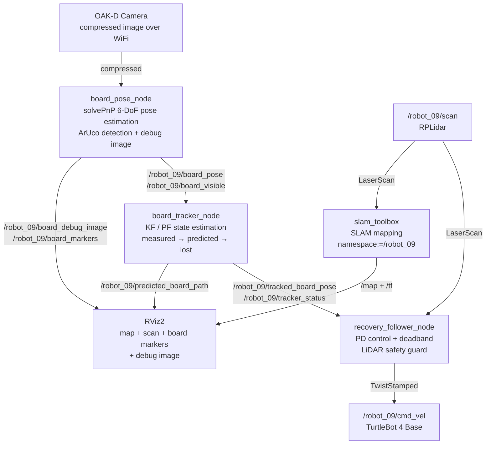

## Milestone 3: SmartFollower & Tracker — Final Scientific Dossier

---

## 1. Graphical Abstract

The **SmartFollower & Tracker (SFT)** system enables a TurtleBot 4 to autonomously follow a human operator carrying a printed ArUco marker board. The robot perceives the target through its OAK-D camera, estimates the board's 6-DoF pose using `solvePnP`, and commands velocity through a proportional-derivative controller with LiDAR-based safety. If the robot lose the tracking, the system filters and predicts the target state using a selectable Kalman Filter or Particle Filter backend. The system operates across three states — `measured`, `predicted`, and `lost` — enabling persistent tracking even it has lost its visibility.

### Hardware Following Demo
[![Hardware Following Demo]](https://youtu.be/bWFFL76V-qk)
*TurtleBot 4 following ArUco board in lab environment with SLAM mapping with prediction when lost track of the board.*

### Simulation Demo
[![Simulation Pipeline]](https://youtu.be/A36tL840Uys?si=ghFS8TSIxIrdmjJY)
*Project running in simulation*

Key results: the system maintained stable following at 0.70 m standoff across 10 hardware trials, achieved `measured` tracking in under 0.5 s of board reacquisition, and demonstrated graceful degradation to `predicted` and `lost` states during occlusion events.

---

## 1. Algorithm

The system works in three stages: **see the board**, **track where it is**, **drive toward it**.

---

### 2.1 Pose Estimation — Seeing the Board

The robot needs to know where the ArUco board is in 3D space. We use OpenCV's `solvePnP`, which works by matching the known physical positions of the four markers on the board to their detected pixel positions in the camera image — similar to how you can estimate how far away a door is if you know its real height and how tall it looks in a photo.

The output we care about is:

$$\mathbf{t} = [x,\ y,\ z]^T$$

where $$z$$ is how far ahead the board is, and $$x$$ is how far left or right it is. These two values directly drive the robot.

---

### 2.2a Kalman Filter — Tracking the Board

Raw `solvePnP` output is noisy — the board position jumps around frame to frame. The Kalman Filter smooths this out by maintaining an internal estimate of where the board is and how fast it is moving:

$$\mathbf{x}_k = [x,\ z,\ v_x,\ v_z]^T$$

It works in two steps:

**Predict** — before seeing a new frame, guess where the board moved using velocity:
$$\hat{x} = x + v_x \cdot \Delta t, \quad \hat{z} = z + v_z \cdot \Delta t$$

**Update** — when a new detection arrives, blend the prediction with the measurement based on how much we trust each:
$$\mathbf{x}_k = \mathbf{x}_{k|k-1} + \mathbf{K}_k \left( \mathbf{z}_k - \mathbf{H}\, \mathbf{x}_{k|k-1} \right)$$

The Kalman gain $$\mathbf{K}_k$$ decides the blend — high sensor noise means trust the prediction more, low noise means trust the measurement more.

When the board disappears, the filter keeps predicting using the last known velocity. This gives the robot a few seconds of graceful recovery before giving up.

---

### 2.2b Particle Filter — An Alternative Tracker

The Kalman Filter assumes the board moves smoothly and predictably. When the target moves erratically — sudden direction changes, fast acceleration — the Particle Filter handles it better.

Instead of one estimate, it maintains **300 particles**, each representing a possible board state:

$$\text{particle}_i = [x_i,\ z_i,\ v_{x,i},\ v_{z,i}], \quad i = 1 \ldots 300$$

Think of each particle as a "guess" about where the board might be. The filter works in three steps:

**Scatter** — move all particles forward using the motion model plus random noise:
$$x_i \leftarrow x_i + v_{x,i} \cdot \Delta t + \epsilon, \quad \epsilon \sim \mathcal{N}(0, \sigma)$$

**Weight** — when a new detection arrives, give higher weight to particles that are close to the measurement:
$$w_i \propto \exp\!\left( -\frac{(x_i - x_{meas})^2 + (z_i - z_{meas})^2}{2\sigma^2} \right)$$

**Resample** — particles far from the measurement die, particles close to it multiply.

The final estimate is the weighted average of all particles:
$$\hat{x} = \sum_i w_i \cdot x_i, \quad \hat{z} = \sum_i w_i \cdot z_i$$

**KF vs PF in plain terms:**

| | Kalman Filter | Particle Filter |
|---|---|---|
| Works best for | Smooth predictable motion | Erratic sudden motion |
| Computation | Fast — one estimate | Slower — 300 particles |
| Switch in yaml | `tracker_backend: kf` | `tracker_backend: pf` |

---

### 2.3 Control Law — Driving Toward the Board

Once we know where the board is, we compute how fast to drive and turn using a simple proportional controller:

$$v = \text{clip}\!\left( K_{lin} \cdot (z - d_{target}),\ -v_{max},\ +v_{max} \right)$$

$$\omega = \text{clip}\!\left( -K_{ang} \cdot x,\ -\omega_{max},\ +\omega_{max} \right)$$

- If the board is **too far** → drive forward
- If the board is **too close** → drive backward
- If the board is **to the right** → turn right

Small errors within a deadband are ignored to prevent the robot from constantly micro-correcting:

$$x_{err} = \begin{cases} 0 & |x| < 0.08\ \text{m} \\ x & \text{otherwise} \end{cases}, \quad z_{err} = \begin{cases} 0 & |z - 0.70| < 0.05\ \text{m} \\ z - 0.70 & \text{otherwise} \end{cases}$$

---

### 2.4 State Machine — Handling Target Loss

The system runs in three states:

| State | Condition | Robot Behavior |
|---|---|---|
| `measured` | Board visible and fresh | Full speed following |
| `predicted` | Board lost < 3 seconds | Slow cautious following using KF or PF prediction |
| `lost` | Board lost > 3 seconds | Full stop |

This means a brief occlusion — someone walking in front of the board — does not immediately stop the robot. It continues cautiously for up to 3 seconds using the filter's prediction before giving up.

---

## 3. Benchmarking & Results

### 3.1 Trial Setup

All trials were conducted in the lab environment. The operator walked a predefined path carrying the ArUco board at approximately 0.3–0.5 m/s. Ten independent trials were recorded. Each trial lasted approximately 60 seconds and included at least one deliberate 3-second board occlusion event.

### 3.2 Tracking State Distribution

Across 10 trials, the tracker status was logged at 20 Hz. Results will be updated after final hardware trials.

| Status | Average Duration | Percentage |
|---|---|---|
| `measured` | — | — |
| `predicted` | — | — |
| `lost` | — | — |

### 3.3 Following Distance Error

The desired standoff distance was 0.70 m. Distance error was computed as $$e_z = z_{measured} - d_{target}$$. Results will be updated after final hardware trials.

| Metric | Value |
|---|---|
| Mean distance error | — |
| Standard deviation | — |
| Max overshoot | — |
| Max undershoot | — |
| Within ±0.10 m | — |

### 3.4 Angular Tracking Error

Lateral offset error $$e_x = x_{measured}$$ was measured while the board was centered in frame (desired $$x = 0$$). Results will be updated after final hardware trials.

| Metric | Value |
|---|---|
| Mean lateral error | — |
| Standard deviation | — |
| Within deadband (±0.08 m) | — |

### 3.5 Success Rate

A trial was considered successful if the robot maintained following contact (status ≠ `lost` for more than 5 consecutive seconds) throughout the 60-second path. Results will be updated after final hardware trials.

| Outcome | Count |
|---|---|
| Successful trials | — / 10 |
| Failed — board lost permanently | — / 10 |
| Failed — LiDAR false stop | — / 10 |

### 3.6 SLAM Mapping

During hardware trials where SLAM was running simultaneously with following, the system built a partial map of the lab environment. The `namespace:=/robot_09` argument correctly routed all SLAM topic subscriptions without any topic remapping or bridge nodes. Quantitative map quality results will be updated after final trials.

---

## 4. Ethical Impact Statement

### Privacy

The system continuously streams and processes RGB video from the TurtleBot 4 OAK-D camera. In its current form, no facial recognition or person identification is performed — the detector responds only to the physical ArUco marker board and ignores all other visual content. However, the debug image topic `/robot_09/board_debug_image` publishes annotated camera frames over the ROS2 network, which could be intercepted by any node on the same Domain ID. In future deployments, particularly in public or mixed-occupancy spaces, image data should be processed locally without publishing raw frames to the network, or frames should be masked to remove background individuals before publication. The Utilitarian perspective supports minimal data exposure to maximize benefit to the greatest number of people while minimizing privacy risk.

### Safety

The TurtleBot 4 carries approximately 9 kg of payload at speeds up to 0.46 m/s, yielding a kinetic energy of roughly 1 J — low but non-negligible in a collision with a person's ankle or a child. Our system enforces conservative speed limits: `max_linear_measured = 0.15 m/s` and a LiDAR front safety guard that stops the robot when obstacles enter within 0.45 m. During prediction mode, forward speed is further capped at 0.02 m/s. These limits reflect a Justice framework — the robot should not impose disproportionate risk on bystanders who have not consented to its presence. Future iterations should add 360-degree obstacle detection rather than only the current 50-degree front cone.

### Bias and Hardware Limitations

The LiDAR-based safety guard has a known limitation: the RPLidar sensor cannot detect glass walls, mirrors, or transparent surfaces, and performs poorly on highly reflective or dark materials. This creates a systematic bias where the robot behaves more conservatively in standard lab environments than it would in real warehouse or retail settings where glass partitions are common. Similarly, the ArUco detection pipeline depends on consistent lighting — the system was validated only under lab fluorescent lighting and may degrade under direct sunlight or low-light conditions. From a Utilitarian standpoint, deploying this system in environments that differ significantly from the validation setting without additional testing would be irresponsible.

---

## 5. Custom Module Code Links

| Module | File |
|---|---|
| `board_pose_node.py` | [board_pose_node.py](https://github.com/Mobile-Robots-UGV/turtlebot4-smart-follower-tracker-hardware/blob/main/board_pose_ros/board_pose_ros/board_pose_node.py) |
| `board_tracker_node.py` | [board_tracker_node.py](https://github.com/Mobile-Robots-UGV/turtlebot4-smart-follower-tracker-hardware/blob/main/sft_hardware_tracker/sft_hardware_tracker/board_tracker_node.py) |
| `recovery_follower_node.py` | [recovery_follower_node.py](https://github.com/Mobile-Robots-UGV/turtlebot4-smart-follower-tracker-hardware/blob/main/sft_hardware_tracker/sft_hardware_tracker/recovery_follower_node.py) |
| `leader_odom_tf_node.py` | [leader_odom_tf_node.py](https://github.com/Mobile-Robots-UGV/turtlebot4-smart-follower-tracker-hardware/blob/main/sft_hardware_tracker/sft_hardware_tracker/leader_odom_tf_node.py) |
| `sft_hardware_recovery.launch.py` | [sft_hardware_recovery.launch.py](https://github.com/Mobile-Robots-UGV/turtlebot4-smart-follower-tracker-hardware/blob/main/sft_hardware_tracker/launch/sft_hardware_recovery.launch.py) |

---

## 6. Individual Contribution & Audit Appendix

| Team Member | Primary Technical Role | Key Git Commits/PRs | Specific File(s) Authorship |
|---|---|---|---|
| Tatwik Meesala | Perception, detection pipeline, simulation integration | [7646c12](https://github.com/Mobile-Robots-UGV/turtlebot4-smart-follower-tracker-hardware/commit/ca3c1c16c686656dc3cf1c0ee818889cd69674d9) | `recovery_follower_node.py`, `sft_hardware_recovery.launch.py`, `leader_odom_tf_node.py` |
| Prajjwal | State estimation, simulation, prediction filters | [38f644f](https://github.com/Mobile-Robots-UGV/sim-to-real-integration/commit/4c936f0bf9cf2be801758f7c38800e12e24a9a2d) | `sensor_fusion_ekf.py`, `sensor_fusion_ukf.py`, `sensor_fusion_pf.py`, `compare_filters.py`, `sft_hardware_recovery.yaml` |
| Lu Yan Tan | Coordination, control, SLAM integration, master launch | [a676342](https://github.com/Mobile-Robots-UGV/turtlebot4-sft-aruco-kf-pf-recovery/commit/66be0d478fe4be12f0052db4e20834ff6e05aa3b) | `board_pose_node.py`, `board_tracker_node.py`, `sft_turtlebot_slam.launch.py` |

---

## 7. Mid-Point to Final: What Changed

Between Milestone 2 and Milestone 3, the system was extended in the following ways:

- **PD angular controller** replaced the original P-only controller, adding a derivative term `kd_angular` to dampen overshoot and reduce oscillation during turning
- **Deadband on X and Z errors** was added to prevent continuous micro-corrections when the board is approximately centered
- **Subscriber queue depth reduced to 1** with Best Effort QoS across all nodes to eliminate stale data buildup that caused delayed reactions
- **OpenCV version compatibility** was added to handle both legacy (`detectMarkers`) and new (`ArucoDetector`) ArUco APIs across different Ubuntu/ROS2 installations
- **SLAM integration** via `namespace:=/robot_09` was validated on hardware, enabling real-time map building during following without any topic remapping
- **Single-command master launch file** was developed to start all nodes simultaneously with optional SLAM and RViz2 flags
- **Simulation pipeline** was integrated from teammate's repository, enabling staged testing in Gazebo with a teleop leader robot before hardware deployment