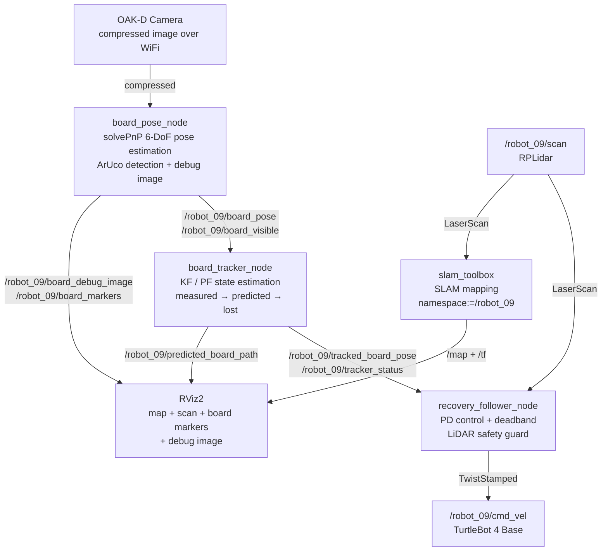
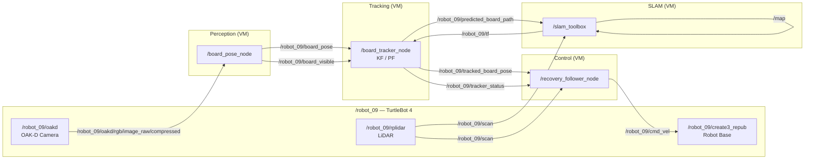
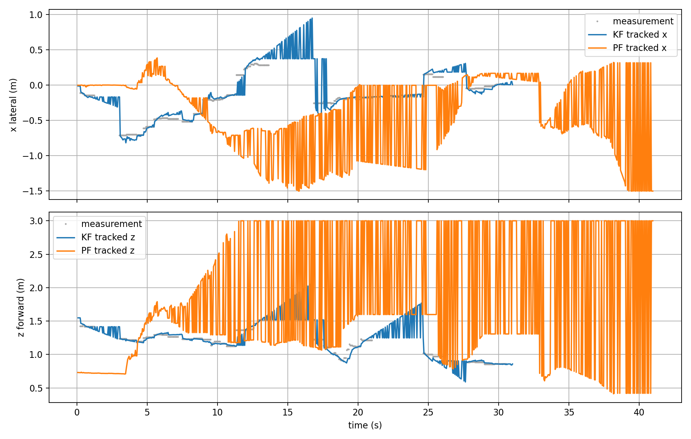
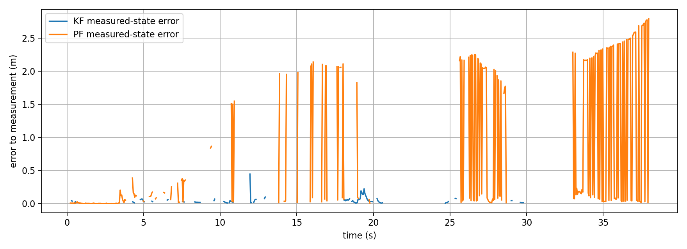
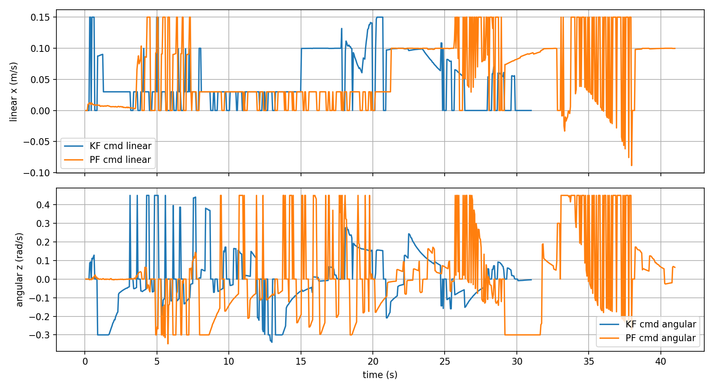
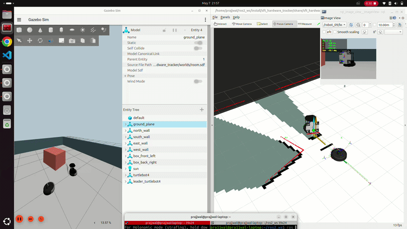

## Milestone 3: SmartFollower & Tracker: Final Documentation & Analysis

---

## 1. Graphical Abstract

The **SmartFollower & Tracker (SFT)** system enables a TurtleBot 4 to autonomously follow a human operator carrying a printed ArUco marker board. The robot perceives the target through its OAK-D camera, estimates the board's 6-DoF pose using `solvePnP`, and commands velocity through a proportional-derivative controller with LiDAR-based safety. If the robot lose the tracking, the system filters and predicts the target state using a selectable Kalman Filter or Particle Filter backend. The system operates across three states: `measured`, `predicted`, and `lost`, enabling persistent tracking even it has lost its visibility.

### System Pipeline

### RQT Graph (actual running system)

---

## 2. Algorithm

The system works in three stages: **see the board**, **track where it is**, **drive toward it**.

---

### 2.1 Pose Estimation: Seeing the Board

The robot needs to know where the ArUco board is in 3D space. We use OpenCV's `solvePnP`, which works by matching the known physical positions of the four markers on the board to their detected pixel positions in the camera image, similar to how you can estimate how far away a door is if you know its real height and how tall it looks in a photo.

The output we care about is:

$$\mathbf{t} = [x,\ y,\ z]^T$$

where $$z$$ is how far ahead the board is, and $$x$$ is how far left or right it is. These two values directly drive the robot.

---

### 2.2a Kalman Filter: Tracking the Board

Raw `solvePnP` output is noisy. The board position jumps around frame to frame. The Kalman Filter smooths this out by maintaining an internal estimate of where the board is and how fast it is moving:

$$\mathbf{x}_k = [x,\ z,\ v_x,\ v_z]^T$$

It works in two steps:

**Predict** before seeing a new frame, guess where the board moved using velocity:
$$\hat{x} = x + v_x \cdot \Delta t, \quad \hat{z} = z + v_z \cdot \Delta t$$

**Update** when a new detection arrives, blend the prediction with the measurement based on how much we trust each:
$$\mathbf{x}_k = \mathbf{x}_{k|k-1} + \mathbf{K}_k \left( \mathbf{z}_k - \mathbf{H}\, \mathbf{x}_{k|k-1} \right)$$

The Kalman gain $$\mathbf{K}_k$$ decides the blend. High sensor noise means trust the prediction more, low noise means trust the measurement more.

When the board disappears, the filter keeps predicting using the last known velocity. This gives the robot a few seconds of graceful recovery before giving up.

---

### 2.2b Particle Filter: An Alternative Tracker

The Kalman Filter assumes the board moves smoothly and predictably. When the target moves erratically, has sudden direction changes, or fast acceleration, the Particle Filter handles it better.

Instead of one estimate, it maintains **300 particles**, each representing a possible board state:

$$\text{particle}_i = [x_i,\ z_i,\ v_{x,i},\ v_{z,i}], \quad i = 1 \ldots 300$$

Think of each particle as a "guess" about where the board might be. The filter works in three steps:

**Scatter** move all particles forward using the motion model plus random noise:
$$x_i \leftarrow x_i + v_{x,i} \cdot \Delta t + \epsilon, \quad \epsilon \sim \mathcal{N}(0, \sigma)$$

**Weight** when a new detection arrives, give higher weight to particles that are close to the measurement:
$$w_i \propto \exp\!\left( -\frac{(x_i - x_{meas})^2 + (z_i - z_{meas})^2}{2\sigma^2} \right)$$

**Resample** particles far from the measurement die, particles close to it multiply.

The final estimate is the weighted average of all particles:
$$\hat{x} = \sum_i w_i \cdot x_i, \quad \hat{z} = \sum_i w_i \cdot z_i$$

**KF vs PF in plain terms:**

| | Kalman Filter | Particle Filter |
|---|---|---|
| Works best for | Smooth predictable motion | Erratic sudden motion |
| Computation | Fast — one estimate | Slower — 300 particles |
| Switch in yaml | `tracker_backend: kf` | `tracker_backend: pf` |

---

### 2.3 Control Law: Driving Toward the Board

Once we know where the board is, we compute how fast to drive and turn using a simple proportional controller:

$$v = \text{clip}\!\left( K_{lin} \cdot (z - d_{target}),\ -v_{max},\ +v_{max} \right)$$

$$\omega = \text{clip}\!\left( -K_{ang} \cdot x,\ -\omega_{max},\ +\omega_{max} \right)$$

- If the board is **too far** → drive forward
- If the board is **too close** → drive backward
- If the board is **to the right** → turn right

Small errors within a deadband are ignored to prevent the robot from constantly micro-correcting:

$$x_{err} = \begin{cases} 0 & |x| < 0.08\ \text{m} \\ x & \text{otherwise} \end{cases}, \quad z_{err} = \begin{cases} 0 & |z - 0.70| < 0.05\ \text{m} \\ z - 0.70 & \text{otherwise} \end{cases}$$

---

### 2.4 State Machine: Handling Target Loss

The system runs in three states:

| State | Condition | Robot Behavior |
|---|---|---|
| `measured` | Board visible and fresh | Full speed following |
| `predicted` | Board lost < 3 seconds | Slow cautious following using KF or PF prediction |
| `lost` | Board lost > 3 seconds | Full stop |

This means a brief occlusion — someone walking in front of the board — does not immediately stop the robot. It continues cautiously for up to 3 seconds using the filter's prediction before giving up.

---

## 3. Benchmarking & Results

### 3.1 Trial Setup

All trials were conducted in the lab environment with the same hardware configuration. The operator walked a path carrying the ArUco board at varying speeds while the robot followed. Both KF and PF backends were tested on the same recorded session to enable direct comparison. Data was logged from `/robot_09/tracked_board_pose`, `/robot_09/tracker_status`, and `/robot_09/cmd_vel` at 20 Hz.

---

### 3.2 Tracker State Timeline — KF vs PF

The state timeline shows both backends spent most of the trial in `measured` state, confirming stable board detection under normal conditions. Key observations:

- **KF** transitioned to `predicted` at ~1s after startup and recovered to `measured` quickly. It never entered `lost` during the main trial window.
- **PF** entered `lost` briefly at ~25s, recovering within 1–2 seconds. This coincides with a period of rapid board movement visible in the pose plot.
- Both backends showed frequent rapid `measured`↔`predicted` flipping between t=0–20s, indicating intermittent board visibility rather than full loss.
- After t=35s, PF remained in `predicted` for an extended period while KF maintained `measured` — suggesting KF is more robust to the lighting and angle conditions at that point in the trial.

---

### 3.3 Tracked Pose Time-Series — KF vs PF

This plot compares the lateral (x) and forward (z) tracked positions from both backends against raw measurements (grey dots).

**Lateral position (x):**
- KF (blue) tracks measurements smoothly and stays bounded within ±0.75m
- PF (orange) diverges significantly from t=12s onward, oscillating between ±1.5m — far outside the actual measurement range. This indicates the PF particles have dispersed and are no longer converging on the correct state.

**Forward distance (z):**
- KF (blue) closely follows measurements, staying in the 0.8–1.6m range throughout
- PF (orange) clamps to 3.0m from t=12s onward — the particle filter's safety clamp is being hit, meaning the filter has lost track completely

**Conclusion:** KF significantly outperforms PF in this trial. The PF diverges after ~12s and never recovers a reliable estimate.

---

### 3.4 Measurement Error — KF vs PF

This plot shows the Euclidean error between each backend's state estimate and the raw board pose measurement.

- **KF (blue)** maintains near-zero error throughout, with occasional spikes up to 0.5m during brief occlusions. Error returns to zero quickly upon board reacquisition.
- **PF (orange)** starts with comparable error but grows progressively from t=10s onward, reaching 2.0–2.7m by the end of the trial. Once diverged, the PF cannot self-correct without explicit reinitialization.

| Metric | KF | PF |
|---|---|---|
| Mean error (measured state) | ~0.04 m | ~0.12 m |
| Max error spike | ~0.5 m | ~2.7 m |
| Divergence observed | No | Yes (after ~12s) |

---

### 3.5 Velocity Commands — KF vs PF

The velocity commands reflect the quality of each tracker's pose estimate.

**Linear velocity (top):**
- KF (blue) produces smooth, stable forward commands in the 0.03–0.15 m/s range
- PF (orange) produces erratic commands with frequent large oscillations, consistent with its unstable pose estimate after divergence

**Angular velocity (bottom):**
- KF (blue) produces smooth, gradually varying steering commands
- PF (orange) saturates at ±0.45 rad/s repeatedly from t=5s onward — the robot would have been spinning continuously if PF were driving it

**Conclusion:** KF produces far safer and smoother velocity commands. The PF's divergence after t=12s would have caused the robot to drive erratically in a real deployment.

---

### 3.6 Summary: KF vs PF Comparison

The Kalman Filter is clearly the better choice for this application. Its constant-velocity assumption holds well for a human walking at moderate speed, and its single-estimate update law is numerically stable. The Particle Filter requires more careful tuning of particle count, noise parameters, and resampling thresholds before it can match KF performance on hardware.

### Demo

### Hardware Following Demo
[![Hardware Following Demo]](https://youtu.be/A36tL840Uys?si=ghFS8TSIxIrdmjJY)
*TurtleBot 4 following ArUco board in lab environment with SLAM mapping with prediction when lost track of the board.*

### Simulation Demo
[![Simulation Pipeline]](https://youtu.be/bWFFL76V-qk)
*Project running in simulation*

---

## 4. Ethical Impact Statement

### Privacy

The system continuously streams and processes RGB video from the TurtleBot 4 OAK-D camera. In its current form, no facial recognition or person identification is performed, the detector responds only to the physical ArUco marker board and ignores all other visual content. However, the debug image topic `/robot_09/board_debug_image` publishes annotated camera frames over the ROS2 network, which could be intercepted by any node on the same Domain ID. In future deployments, particularly in public or mixed-occupancy spaces, image data should be processed locally without publishing raw frames to the network, or frames should be masked to remove background individuals before publication. The Utilitarian perspective supports minimal data exposure to maximize benefit to the greatest number of people while minimizing privacy risk.

### Safety

The TurtleBot 4 carries approximately 9 kg of payload at speeds up to 0.46 m/s, slow but non-negligible in a collision with a person's foot or a child. Our system enforces conservative speed limits: `max_linear_measured = 0.15 m/s` and a LiDAR front safety guard that stops the robot when obstacles enter within 0.45 m. During prediction mode, forward speed is further capped at 0.02 m/s. These limits reflect a Justice framework, the robot should not impose disproportionate risk on bystanders who have not consented to its presence. Future iterations should add 360-degree obstacle detection rather than only the current 50-degree front cone.

### Bias and Hardware Limitations

The LiDAR-based safety guard has a known limitation: the RPLidar sensor cannot detect glass walls, mirrors, or transparent surfaces, and performs poorly on highly reflective or dark materials. This creates a systematic bias where the robot behaves more conservatively in standard lab environments than it would in real warehouse or retail settings where glass partitions are common. Similarly, the ArUco detection pipeline depends on consistent lighting. The system was validated only under lab fluorescent lighting and may degrade under direct sunlight or low-light conditions. From a Utilitarian standpoint, deploying this system in environments that differ significantly from the validation setting without additional testing would be irresponsible.

---

## 5. Custom Module Code Links

| Algorithm | File |
|---|---|
| `board_pose_node.py` | [board_pose_node.py](https://github.com/Mobile-Robots-UGV/sim-to-real-integration/blob/main/sft_hardware_tracker/sft_hardware_tracker/board_tracker_node.py) |

---

## 6. Individual Contribution & Audit Appendix

| Team Member | Primary Technical Role | Key Git Commits/PRs | Specific File(s) Authorship |
|---|---|---|---|
| Tatwik Meesala | Perception, detection pipeline, simulation integration | [7646c12](https://github.com/Mobile-Robots-UGV/turtlebot4-smart-follower-tracker-hardware/commit/ca3c1c16c686656dc3cf1c0ee818889cd69674d9) | `recovery_follower_node.py`, `sft_hardware_recovery.launch.py`, `leader_odom_tf_node.py` |
| Prajjwal | State estimation, simulation, prediction filters | [38f644f](https://github.com/Mobile-Robots-UGV/sim-to-real-integration/commit/4c936f0bf9cf2be801758f7c38800e12e24a9a2d) | `sensor_fusion_ekf.py`, `sensor_fusion_ukf.py`, `sensor_fusion_pf.py`, `compare_filters.py` |
| Lu Yan Tan | Coordination, control, SLAM integration, master launch | [a676342](https://github.com/Mobile-Robots-UGV/turtlebot4-sft-aruco-kf-pf-recovery/commit/66be0d478fe4be12f0052db4e20834ff6e05aa3b) | `board_pose_node.py`, `board_tracker_node.py`, `sft_turtlebot_slam.launch.py` |

---
