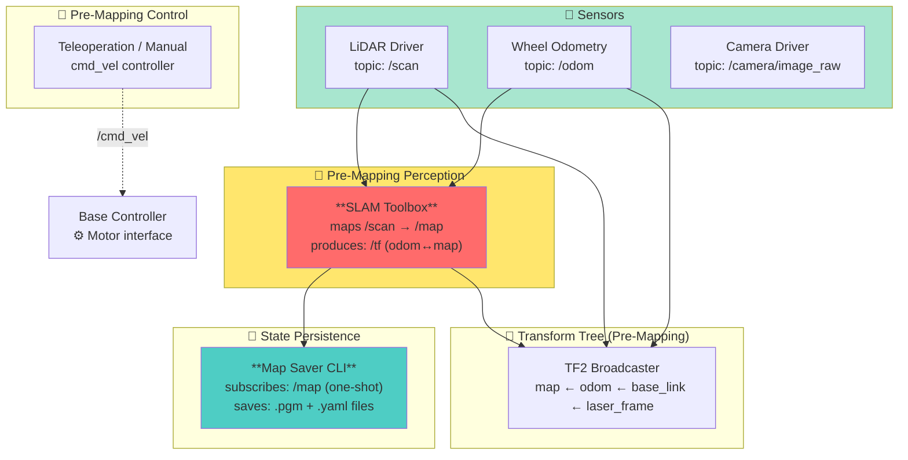
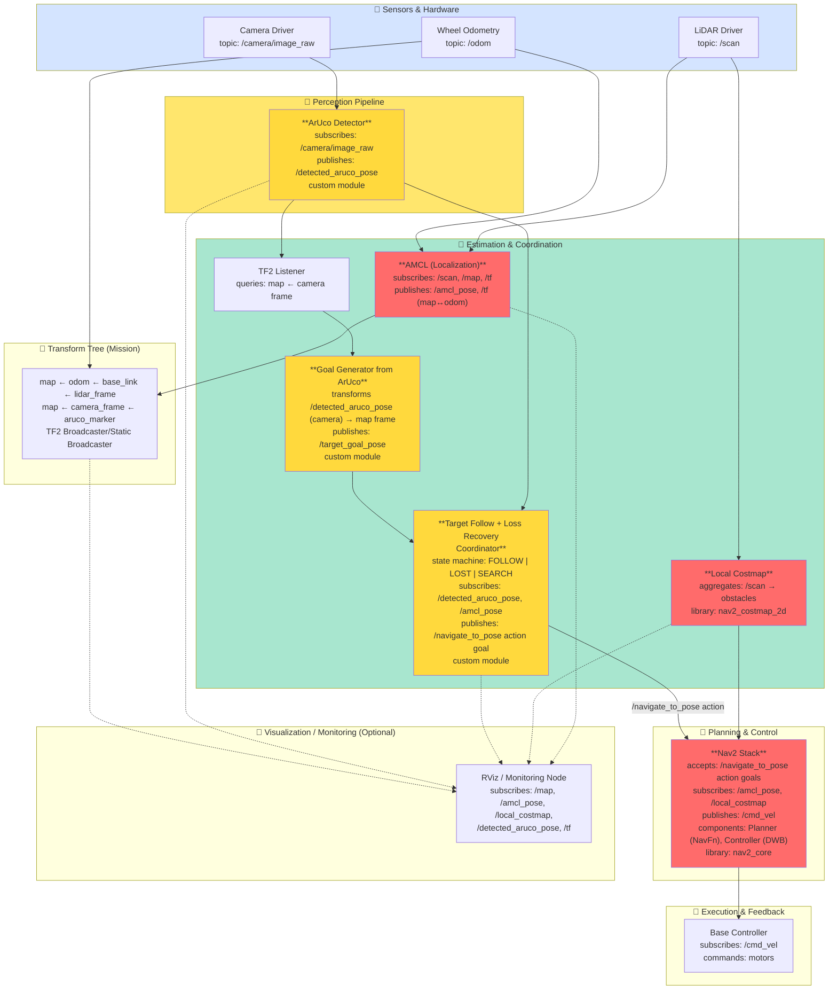
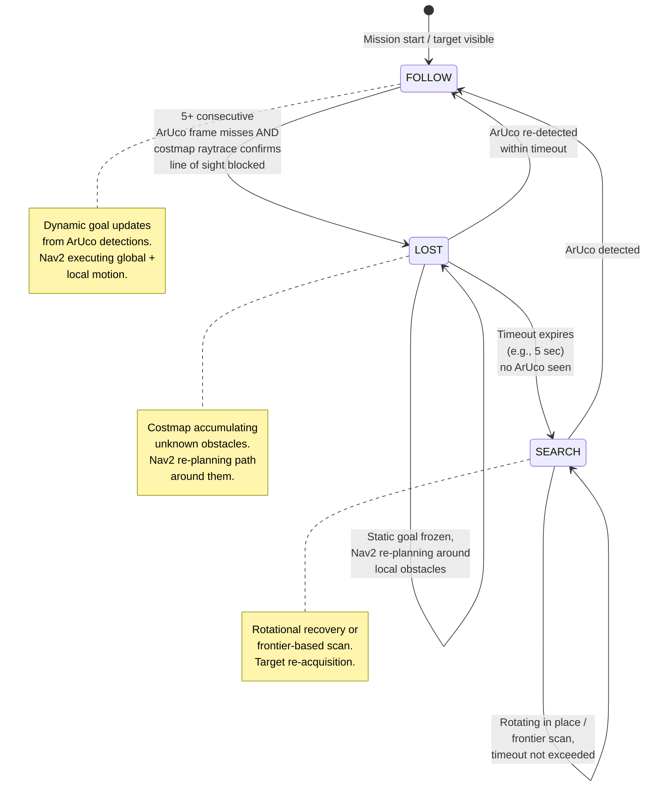

## 3. High-Level System Architecture

This autonomous mobile robot system implements two-phase operation: **(A) Pre-Mapping** to build a static 2D occupancy grid, and **(B) Mission** to autonomously follow a moving ArUco marker-bearing target while reactively avoiding unknown obstacles. The architecture integrates perception (LiDAR + camera), localization (AMCL), motion planning (Nav2), and custom coordination logic to handle target loss due to occlusion and recover through local replanning.

### 3.1 System Data Flow Diagrams

#### 3.1.1 Pre-Mapping Mode

#### 3.1.2 Mission Mode (Full System)

#### 3.1.3 State Machine: Target Follow + Loss Recovery Coordinator

---

### 3.2 Module Declaration Table

| **Module Name** | **Type** | **ROS 2 Package / Repo** | **Inputs (topics/services)** | **Outputs (topics/actions)** | **Key Parameters to Tune** |
|---|---|---|---|---|---|
| **LiDAR** | Library | Driver-specific (e.g., `sick_scan2` or `livox_ros_driver2`) | N/A (reads hardware) | `/scan` (sensor_msgs/LaserScan) | Max range, angular resolution, scan rate (10–25 Hz typical) |
| **Wheel Odometry** | Library (base firmware) | Differential-drive base firmware | Motor encoders (hardware) | `/odom` (nav_msgs/Odometry), `/tf` (odom→base_link) | Wheel radius, track width, encoder PPR, drift compensation |
| **Camera Driver & Calibration** | Library | e.g., `usb_cam`, `cv_camera`, or camera-specific package | N/A (reads hardware) | `/camera/image_raw` (sensor_msgs/Image) or `/camera/camera_info` | Image resolution, frame rate, intrinsic calibration (stored in YAML) |
| **SLAM Toolbox** | Library | `slam_toolbox` (ROS 2 Jazzy) | `/scan`, `/tf` (odom→base_link), optionally `/odom` | `/map` (nav_msgs/OccupancyGrid), `/tf` (map↔odom), `/graph_visualization` | Loop closure threshold, minimum travel distance, occupancy threshold |
| **Map Saver** | Library | `nav2_map_server` map_saver CLI | `/map` (subscribes to save) | Serialized map file (.pgm, .yaml) | Output directory, map resolution |
| **Map Server** | Library | `nav2_map_server` | N/A (loads from disk) | `/map` (nav_msgs/OccupancyGrid), `/map_metadata` | Map file path, resolution, origin |
| **AMCL (Localization)** | Library | `nav2_amcl` (nav2 package) | `/scan`, `/map`, `/tf` (odom→base_link) | `/amcl_pose` (geometry_msgs/PoseWithCovarianceStamped), `/tf` (map→odom), `/particle_cloud` | Initial pose, particle count (50–500), scan matching model, update rates |
| **TF2 Broadcaster** | Library | `tf2_ros` | `/odom`, odometry topics, sensor poses (static) | `/tf`, `/tf_static` | Broadcaster type (TransformBroadcaster, StaticTransformBroadcaster) |
| **Local Costmap (Obstacle Layer)** | Library | `nav2_costmap_2d` (nav2 package) | `/scan`, `/tf`, `/amcl_pose` | Local costmap as layer in Nav2's CostmapServer | Decay rate, unknown threshold, inflation radius, update frequency |
| **Nav2 Planner (Navfn / Theta\*)** | Library | `nav2_navfn_planner` or `nav2_theta_star_planner` | `/map`, `/costmap`, `/tf`, goal service call | `/plan` (nav_msgs/Path) | Potential scale, lethal cost threshold, planning timeout |
| **Nav2 Controller (DWB / MPPI)** | Library | `nav2_dwb_controller` or `nav2_mppi_controller` (ROS 2 Jazzy) | `/costmap`, `/tf`, `/odom`, `/path` | `/cmd_vel` (geometry_msgs/Twist) | Max velocity, max angular velocity, acceleration limits, lookahead distance |
| **ArUco Detector** | Custom | Custom (this project) | `/camera/image_raw` | `/detected_aruco_pose` (geometry_msgs/PoseStamped, relative to camera frame) | ArUco dictionary (DICT_5X5_100), marker size (physical cm), detection threshold |
| **Goal Generator from ArUco** | Custom | Custom (this project) | `/detected_aruco_pose`, `/tf`, `/amcl_pose` | `/target_goal_pose` (geometry_msgs/PoseStamped, in map frame) | Goal offset from ArUco (e.g., 0.5 m behind), smoothing window size |
| **Target Follow + Loss Recovery Coordinator** | Custom | Custom (this project) | `/detected_aruco_pose`, `/amcl_pose`, `/scan`, `/local_costmap` | `/navigate_to_pose` action goal (nav2_msgs/action/NavigateToPose), diagnostics topic | Frame miss threshold (5), loss timeout (2–5 sec), search duration (10–30 sec), rotation speed |
| **Visualization / Monitoring** | Library | `rviz2`, custom marker publisher | `/map`, `/amcl_pose`, `/detected_aruco_pose`, `/tf`, `/local_costmap`, `/amcl_particle_cloud` | Visualization markers, diagnostics | RViz config file |

---

### 3.3 Module Intent Writeups

#### 3.3.1 Hardware Drivers & Firmware

**LiDAR**
The LiDAR driver continuously publishes 2D laser scans at 10–25 Hz to `/scan`. It is critical for both SLAM (pre-mapping) and dynamic obstacle detection (mission). We will tune the **scan rate** and **max range** to balance update frequency and computational load. Typical 2D LiDAR for TurtleBot-scale robots (e.g., SICK TiM781) operates at ~25 Hz with ~8 m max range. During obstacle occlusion events, raw scan data feeds both AMCL (localization) and the Local Costmap (unknown obstacle detection).

**Wheel Odometry & Base Controller**
The differential-drive base firmware encodes wheel ticks into `/odom`, providing high-frequency (~50 Hz) relative motion estimates. For localization drift mitigation, **wheel radius** and **track width** calibration are critical tuning parameters. Odometry feeds both SLAM (pre-mapping) and AMCL (mission), and must maintain low drift over short timescales (<30 sec). The base controller translates `/cmd_vel` Twist messages into motor PWM commands.

**Camera Driver & Calibration**
Publishes RGB image frames (or RGBD if available) at 15–30 Hz to `/camera/image_raw`. Camera intrinsic calibration (focal length, principal point, distortion coefficients) must be precomputed and stored in a ROS 2 camera_info YAML file. Calibration accuracy directly impacts ArUco pose estimation error in the camera frame, which propagates through the transform chain.

#### 3.3.2 SLAM & Mapping

**SLAM Toolbox**
- **Type:** Library
- **Why chosen:** SLAM Toolbox is the standard ROS 2 Jazzy SLAM front-end for 2D LiDAR on indoor platforms. It performs scan matching and loop closure detection to build a globally consistent 2D occupancy grid. During pre-mapping, the robot is teleoperated through the environment via `/cmd_vel`; SLAM processes incoming `/scan` data and odometry into `/map` and publishes transforms (map ↔ odom ↔ base_link). After exploration, `map_saver` CLI tool is invoked to serialize the map to disk (.pgm image + .yaml metadata).
- **Key tuning parameters:**
  - **Loop closure threshold:** Aggressiveness of loop detection (higher = fewer false closures).
  - **Minimum travel distance:** Distance before loop closure search; balances speed vs. global quality.
  - **Occupancy threshold:** Frontier between free and occupied cells in the map.
- **Edge cases:** Repetitive environments (long corridors, identical textures) may cause loop closure failures or inconsistent maps. Requires manual teleoperation discipline and RViz verification.

**Map Saver (nav2_map_server)**
- **Type:** Library
- **Why chosen:** After SLAM exploration completes, `map_saver` is invoked (one-shot) to subscribe to `/map`, serialize it, and write the occupancy grid (`.pgm` image) and metadata (`.yaml` with resolution, origin, occupied/free thresholds) to disk. This saved map is later loaded by Map Server during the mission phase.
- **Key parameters:**
  - **Output directory:** Where .pgm and .yaml files are saved.
  - **Map resolution:** Inherited from SLAM; typically 0.05 m/cell.
  - **Thresholds:** Occupied/free cost thresholds applied during serialization.

#### 3.3.3 Localization

**AMCL (Adaptive Monte Carlo Localization)**
- **Type:** Library
- **Why chosen:** During the mission phase, the robot must localize against the pre-built static map produced in Phase 1. AMCL is the standard Monte Carlo localization package for ROS 2 Jazzy. It subscribes to real-time `/scan` and the fixed `/map`, performing scan-to-map matching to correct odometry drift and estimate the robot's pose in the global map frame. AMCL publishes `/amcl_pose` and the map→odom transform, grounding all downstream transformations (e.g., camera frame to map frame).
- **Key tuning parameters:**
  - **Particle count:** 50–500 particles; higher accuracy trades off against CPU load.
  - **Initial pose uncertainty:** Covariance for pose initialization; should match expected pre-mission localization error.
  - **Scan matching model:** `beam` or `likelihood_field`; affects convergence and robustness.
  - **Update rates:** Publication frequency (~10 Hz typical) and scan update period; balance latency vs. CPU.
- **Edge cases:**
  - Global kidnapping (robot moved without encoder feedback) requires manual re-localization.
  - Indistinguishable map regions (uniform empty spaces) cause multimodal posteriors; monitor particle cloud divergence in RViz.
  - Sparse, featureless maps may cause divergence.

#### 3.3.4 Costmaps & Obstacle Representation

**Local Costmap Server (nav2_costmap_2d)**
- **Type:** Library
- **Why chosen:** Nav2's local costmap server maintains a 2.5D rolling window (e.g., ±2.5 m) centered on the robot, updated in real-time from LiDAR scans. Its **obstacle layer** marks both mapped obstacles (from the static map layer) and unknown obstacles (dynamic, unmodeled). The global costmap is slower-updating and derived from the static pre-mapped occupancy grid. Together, they enable Nav2's planner (global costmap) and controller (local costmap) to navigate while avoiding real-time hazards.
- **Unknown obstacle handling:**
  - Real-time LiDAR hits populate the local costmap's obstacle layer.
  - Cells in the obstacle layer that don't correspond to the static map are marked as **unknown obstacles**.
  - The obstacle layer decays over time (decay_rate); unobserved cells gradually clear, preventing phantom obstacles.
  - When an unknown obstacle occludes the target, Nav2 replans using the updated local costmap layers.
- **Key tuning parameters:**
  - **Decay rate:** Controls how fast unobserved obstacles clear; shorter decay = more responsive to transient obstacles.
  - **Unknown cost threshold:** Cost value marking unknown obstacles (typically 254 for binary occupancy).
  - **Inflation radius:** Expands obstacle cost gradient; prevents goal placement in tight spaces.
  - **Update frequency:** 5–10 Hz; balance responsiveness with CPU load.

#### 3.3.5 Planning & Control

**Nav2 Stack (Planner & Controller)**
- **Type:** Library
- **Why chosen:** Nav2 (Navigation 2) is the industrial-standard motion planning and control middleware for ROS 2. It provides both **global planning** (e.g., NavFn or Theta*) to compute a path from start to goal, and **local control** (e.g., Dynamic Window Approach (DWB) or MPPI) to track that path while avoiding obstacles detected in real-time by the local costmap.
- **Behavioral modes:**
  - **Pre-mapping:** Nav2 is inactive; manual teleoperation controls `/cmd_vel`.
  - **Mission (target visible):** Nav2 is active; the Coordinator publishes dynamic goal poses derived from ArUco detections. Nav2 recomputes the global plan and maintains local tracking.
  - **Mission (target occluded, unknown obstacle present):** Nav2 is still active but the goal is static (last-known target pose). The local costmap accumulates unknown obstacles; Nav2's controller re-plans a path around them.
- **Key tuning parameters:**
  - **Planner (Navfn/Theta*):** Lethal cost threshold, potential scale; these define cost-to-distance mapping for path quality.
  - **Controller (DWB/MPPI):** Maximum linear and angular velocities, acceleration limits, lookahead distance, scoring weights for trajectory evaluation.
- **Edge cases & recovery:**
  - If a goal is placed in a collision cell, Nav2's goal checker may fail. The Coordinator must validate goal poses before publishing.
  - If the robot is trapped, Nav2 publishes control signals even if no path exists; the controller may rotate in place. The Coordinator monitors this and can trigger the SEARCH state.

#### 3.3.6 Transform System (TF2)

**TF2 Broadcaster (Transform Tree)**
- **Type:** Library
- **Why chosen:** TF2 is ROS 2's canonical system for managing coordinate frame transformations. It maintains a tree of transforms (map ← odom ← base_link ← sensor_frames) and allows any node to query the spatial relationship between any two frames at any timestamp.
- **Transform tree structure:**
  - **map (static):** Global reference frame; produced by SLAM (pre-mapping) or provided by map server (mission).
  - **odom ← map (updating):** Produced by AMCL; corrects for odometry drift.
  - **base_link ← odom (continuous):** Produced by wheel odometry; high-frequency relative motion tracking.
  - **Sensor frames (static relative to base_link):** `lidar_frame`, `camera_frame`, `aruco_marker` (dynamic, detected by ArUco module)
- **Key tuning parameters:**
  - **Broadcaster rates:** How often tf messages are published (typically 50–100 Hz for dynamic transforms).
  - **Frame names:** Must match sensor manufacturer specs and be consistent across launch files.

#### 3.3.7 Perception: ArUco Marker Detection (Custom)

**ArUco Detector**
- **Type:** Custom
- **Key responsibility:** Detect ArUco markers in camera images, compute their 3D pose relative to the camera frame, and publish to `/detected_aruco_pose`.
- **Core algorithm:**
  1. Subscribe to `/camera/image_raw` at camera frame rate (15–30 Hz).
  2. Apply OpenCV's ArUco detection pipeline: detect candidate marker corners using adaptive thresholding, validate corner patterns against the ArUco dictionary (e.g., DICT_5X5_100), reject false positives using confidence thresholding.
  3. Use solvePnP to compute marker 3D pose in the camera frame using known marker size and camera intrinsics.
  4. Publish pose as `geometry_msgs/PoseStamped` with `frame_id = camera_frame` to `/detected_aruco_pose`.
- **Edge cases & robustness:**
  - **False positives:** Clutter or reflections can trigger false detections. Mitigation: confidence thresholding and spatial filtering.
  - **Intermittent detections:** Occlusion, motion blur, or glints make detection intermittent. The Coordinator maintains a detection history and performs temporal smoothing.
  - **Scale ambiguity:** Marker size must be calibrated and fixed before mission.
  - **Multiple markers in frame:** Preferentially select the nearest or largest based on application intent.
- **Success criteria:** Detects target marker at distances 0.5–3 m with <5% pose error; recovers from 1–2 frame intermittent occlusions; rejects false positives at >95% rate.

#### 3.3.8 Goal Generation from ArUco (Custom)

**Goal Generator from ArUco**
- **Type:** Custom
- **Key responsibility:** Transform ArUco-detected pose from camera frame to map frame, compute a reachable goal pose slightly offset from the target, and publish to `/target_goal_pose`.
- **Core algorithm:**
  1. Subscribe to `/detected_aruco_pose` (in camera_frame).
  2. Query TF2 to obtain the transformation chain: camera_frame → base_link → odom → map.
  3. Transform detected pose from camera_frame to map frame using TF2.
  4. Compute goal pose as a point **offset behind the target** (e.g., 0.5 m in the direction opposite to the robot's approach).
  5. Apply optional temporal smoothing (moving average over last N detections) to reduce jitter.
  6. Publish goal to `/target_goal_pose` at ~10 Hz.
- **Edge cases:** TF chain breaks (logs error and skips), ambiguous orientation (heuristic resolution), large pose jumps (temporal smoothing or rejection of jumps >0.5 m).
- **Success criteria:** Transforms ArUco pose to map frame with <0.1 m error; goal pose always reachable; temporal jitter <0.2 m s.d.

#### 3.3.9 Target Follow + Loss Recovery Coordinator (Custom)

**Target Follow + Loss Recovery Coordinator**
- **Type:** Custom
- **Key responsibility:** Implement a state machine (FOLLOW → LOST → SEARCH) to coordinate target-following behavior and recovery from occlusion-induced loss, sending Nav2 goals via `/navigate_to_pose` action.
- **Core state machine:**
  - **FOLLOW:** Target continuously detected. Subscribe to `/detected_aruco_pose` and query Goal Generator's latest `/target_goal_pose`. Send goals to Nav2 at 5–10 Hz.
  - **FOLLOW → LOST transition:** N ≥5 consecutive ArUco frame misses AND local costmap raytrace detects line-of-sight blockage. Freeze goal at last-known target pose; start loss timer (2–5 sec).
  - **LOST:** Goal is static (last-known target). Nav2 recomputes path around obstacles. Monitor for re-detection or obstacle clearing.
  - **LOST → SEARCH transition:** Loss timeout expires (≥5 sec) and ArUco still absent.
  - **SEARCH:** Execute rotational sweep or frontier-based movement for 15–30 sec. On re-detection, immediately transition to FOLLOW.
- **Edge cases:** (1) False occlusion: require 5 consecutive misses + costmap raytrace. (2) Phantom obstacles: validate cells persist across 2+ updates. (3) Goal unreachability: Goal Generator validates against costmap. (4) Search timeout: max 60 sec, then return to FOLLOW.
- **Success criteria:** Detect occlusion within 0.5 sec; re-acquire target within 10 sec; avoid >50 cm unnecessary detours; recover 90%+ of loss events.

#### 3.3.10 Visualization & Diagnostics

**RViz / Monitoring Node**
- **Type:** Library / Optional Custom
- Publishes visualization markers for map, robot pose, detected target, costmaps, and particle cloud. Critical for manual validation during development and mission monitoring. RViz configuration files specify which topics to display and layer ordering.
- **Optional custom diagnostics node:** Aggregates module health (AMCL convergence, detection drop rate, loss event count) for real-time mission status.

---

### 3.4 Algorithmic Abstract

**Objective & Overview:**
An autonomous mobile robot must visually track a moving target bearing an ArUco marker while avoiding both pre-mapped static obstacles and dynamically detected unknown obstacles. The system architecture integrates two operational phases: **(A) pre-mapping**, during which SLAM Toolbox builds a static 2D occupancy grid via teleoperated exploration, saved using `map_saver` CLI, and **(B) mission**, during which the robot localizes against the saved map using AMCL and pursues a dynamic goal generated from real-time ArUco marker detections via nav2_msgs actions.

**Mission Criticality:**
The primary challenge in the mission phase is handling **occlusion-induced target loss**. When an unknown obstacle physically obstructs the line of sight between the robot's camera and the target marker, two inter-dependent failures occur: (1) the ArUco detector loses visual contact and (2) the robot cannot update its pursuit goal. The system must detect this failure mode, freeze the goal at the last-known target position, trigger local replanning via Nav2 to circumvent the newly-detected obstacle, and subsequently recover visual contact.

**System Architecture:**

*Perception.* Two parallel sensing modalities feed the system: (i) 2D LiDAR (`/scan`, 10–25 Hz) for simultaneous localization (AMCL), global costmap construction, and unknown obstacle detection via the local obstacle layer in nav2_costmap_2d; (ii) RGB camera (`/camera/image_raw`, 15–30 Hz) for ArUco marker detection via OpenCV's ArUco pipeline, yielding marker pose in the camera frame.

*Estimation & Coordination.* **AMCL** subscribes to `/scan` and pre-mapped `/map` to correct odometry drift and publish `/amcl_pose` in the map frame, grounding all subsequent transformations. A custom **ArUco Detector** performs real-time marker detection with confidence thresholding and spatial filtering. Detected pose is transformed to map frame via TF2 and forwarded to a custom **Goal Generator**, which computes an offset goal (e.g., 0.5 m from target) ensuring reachability. A state-machine-based **Target Follow + Loss Recovery Coordinator** monitors detection status and obstacle accumulation, sending goals to Nav2 via the `NavigateToPose` action server to orchestrate three behavioral states:

1. **FOLLOW:** Target is continuously detected; dynamic goal updates flow to Nav2 at ~5 Hz. Nav2's planner (NavFn/Theta*) and controller (DWB/MPPI) track the moving goal while avoiding mapped obstacles via the global costmap.
2. **LOST:** N ≥5 consecutive ArUco frame misses AND local costmap raytrace confirms line-of-sight blockage. The Coordinator freezes the goal at last-known target pose and starts a loss timer (2–5 sec). Nav2 remains active; it replans the path around the newly-detected obstacle using the local costmap.
3. **SEARCH (optional):** If the loss timeout expires without re-detection, the Coordinator initiates a recovery search behavior for 15–30 sec to increase visibility range and re-acquire the target.

*Actuation.* Nav2 outputs control commands (`/cmd_vel`) that are executed by the differential-drive base.

**Unknown Obstacle Handling:**
Unknown obstacles are represented in nav2_costmap_2d's obstacle layer as cells marked from real-time LiDAR hits that do not correspond to pre-mapped free cells. A decay mechanism clears unmarked cells over time, preventing permanent phantom obstacles. When an unknown obstacle occludes the target, the coordinator detects the loss event (visual + costmap evidence), freezes the last-known goal, and Nav2 recomputes a path around the obstacle. Once the obstacle is cleared and the target re-appears, FOLLOW resumes.

**Edge Cases & Robustness:**
- *False occlusion:* Intermittent frame-level ArUco losses do not trigger LOST; the system requires N ≥5 consecutive misses plus costmap raytrace confirmation.
- *Phantom obstacles:* Transient LiDAR noise is mitigated by requiring obstacle cells to persist across 2+ updates; costmap decay clears unobserved cells over time.
- *Goal unreachability:* The Goal Generator validates computed goals against the costmap; if unreachable, it offsets sideways or closer.
- *Search timeout:* If target moves beyond search range, the system times out at max 60 sec and returns to FOLLOW.

**Success Metrics:**
- Pre-mapping: Static map resolution ≥5 cm/cell with <2% unexplored area.
- Mission (tracking): Maintains visual contact ≥90% of mission time when target is visible and unobstructed.
- Mission (loss recovery): Detects occlusion within 0.5 sec; re-acquires target within 10 sec; avoids unnecessary detours (>50 cm inflation).
- Robustness: Recovers from 90%+ of temporary occlusions; gracefully degrades if permanent loss occurs.

---

### 3.5 Terminology Reference

| Term | Definition |
|---|---|
| **Pre-mapping** | Phase 1: teleoperated SLAM exploration to build an offline 2D occupancy grid. |
| **Mission** | Phase 2: autonomous target-following against a pre-built map using AMCL localization. |
| **Line of Sight (LOS)** | Direct unobstructed visual path from camera to ArUco marker. |
| **ArUco marker** | Fiducial (visual barcode) on the target object, detectable by OpenCV. |
| **Occlusion-induced loss** | Target loss caused by a physical obstacle blocking LOS. |
| **Unknown obstacle** | An obstacle not present in the pre-mapped occupancy grid; detected in real-time by LiDAR. |
| **Local costmap** | High-resolution, centered costmap (~5×5 m) updated in real-time from LiDAR; used by Nav2 for local path planning. |
| **Global costmap** | Low-resolution costmap derived from the pre-mapped occupancy grid; used by Nav2's planner. |
| **Nav2 goal** | Target pose (x, y, θ) that Nav2 planner/controller aim to reach. |
| **Recovery behavior** | Fallback strategy (e.g., search rotation) triggered when target is lost. |
