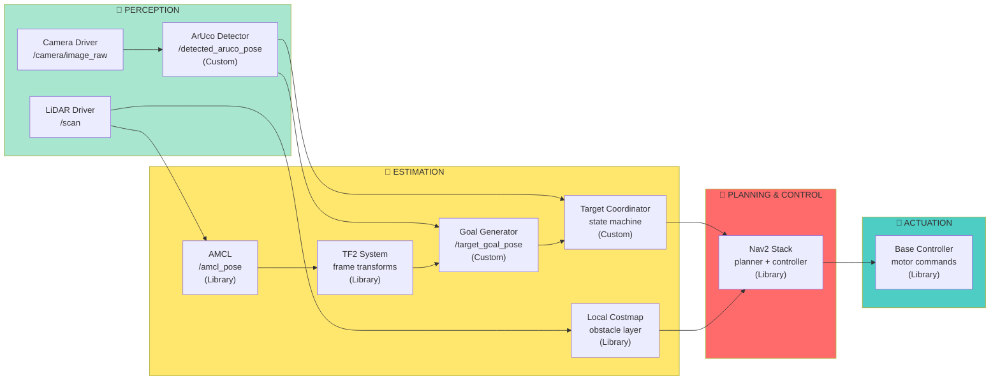
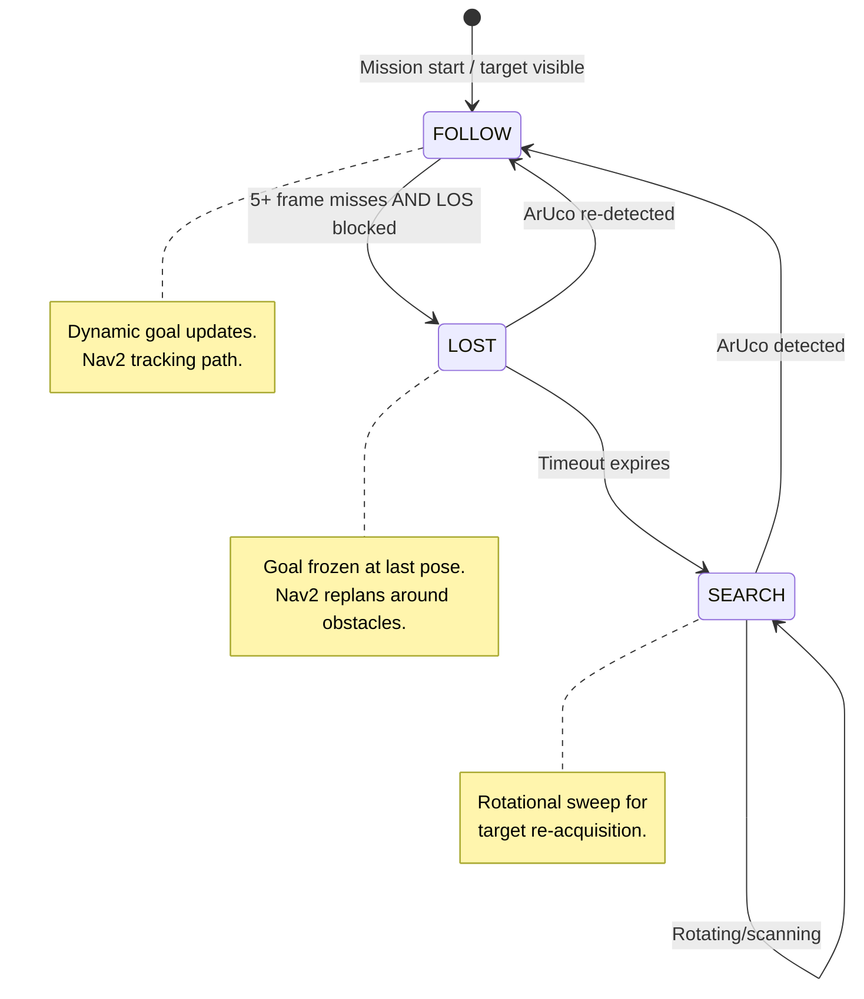

## 3. High-Level System Architecture

This autonomous mobile robot system operates in two phases: **(A) Pre-Mapping** to build a static 2D occupancy grid via teleoperated SLAM, and **(B) Mission** to autonomously follow a moving ArUco marker-bearing target while avoiding unknown obstacles. The architecture follows the **Perception → Estimation → Planning → Actuation** convention.

### 3.1 System Data Flow Diagrams

#### 3.1.1 Mission Mode Data Flow (Perception → Estimation → Planning → Actuation)

#### 3.1.2 State Machine: Target Follow + Loss Recovery

---

### 3.2 Module Declaration Table

| **Module Name** | **Type** | **ROS 2 Package** | **Inputs** | **Outputs** |
|---|---|---|---|---|
| **LiDAR Driver** | Library | Driver-specific | Hardware | `/scan` (sensor_msgs/LaserScan) |
| **Wheel Odometry** | Library | Base firmware | Motor encoders | `/odom`, `/tf` (odom→base_link) |
| **Camera Driver** | Library | usb_cam / cv_camera | Hardware | `/camera/image_raw` (sensor_msgs/Image) |
| **SLAM Toolbox** | Library | slam_toolbox | `/scan`, `/tf`, `/odom` | `/map`, `/tf` (map↔odom) |
| **Map Server** | Library | nav2_map_server | Disk file | `/map` (nav_msgs/OccupancyGrid) |
| **AMCL** | Library | nav2_amcl | `/scan`, `/map`, `/tf` | `/amcl_pose`, `/tf` (map→odom) |
| **Local Costmap** | Library | nav2_costmap_2d | `/scan`, `/tf`, `/amcl_pose` | Costmap layers (obstacle) |
| **Nav2 Planner** | Library | nav2_navfn_planner | `/map`, `/costmap`, `/tf` | `/plan` (nav_msgs/Path) |
| **Nav2 Controller** | Library | nav2_dwb_controller | `/costmap`, `/tf`, `/path` | `/cmd_vel` (geometry_msgs/Twist) |
| **ArUco Detector** | Custom | Custom (this project) | `/camera/image_raw` | `/detected_aruco_pose` (geometry_msgs/PoseStamped) |
| **Goal Generator** | Custom | Custom (this project) | `/detected_aruco_pose`, `/tf` | `/target_goal_pose` (geometry_msgs/PoseStamped) |
| **Target Coordinator** | Custom | Custom (this project) | `/detected_aruco_pose`, `/amcl_pose`, `/scan`, costmap | `/navigate_to_pose` action goals |
| **TF2 Broadcaster** | Library | tf2_ros | Sensor poses, odometry | `/tf`, `/tf_static` |
| **Base Controller** | Library | Base firmware | `/cmd_vel` | Motor PWM commands |

---

### 3.3 Module Intent Writeups

#### Library Modules

**LiDAR Driver**
Continuously publishes 2D laser scans at 10–25 Hz. Critical for SLAM (pre-mapping) and real-time obstacle detection. **Tuning parameters:** scan rate, max range, angular resolution. For TurtleBot-scale robots (e.g., SICK TiM781), typical settings are ~25 Hz scan rate with 8 m max range. During occlusion events, scan data feeds both AMCL for localization and the local costmap for dynamic obstacle detection.

**Wheel Odometry & Base Controller**
Encoder-based odometry provides high-frequency (~50 Hz) relative motion estimates. The base controller translates `/cmd_vel` into motor PWM. **Tuning parameters:** wheel radius, track width, encoder counts per revolution, drift compensation. Accurate calibration is essential for localization—odometry drift must remain <30 cm over 30 seconds. Both feed SLAM during pre-mapping and AMCL during mission.

**Camera Driver**
Publishes RGB image frames at 15–30 Hz to `/camera/image_raw`. Must include precomputed intrinsic calibration (focal length, principal point, distortion) in a ROS 2 camera_info YAML file. **Tuning parameters:** resolution, frame rate, distortion coefficients. Calibration accuracy directly impacts ArUco pose estimation error in the camera frame.

**SLAM Toolbox (Pre-Mapping Phase)**
Standard ROS 2 Jazzy SLAM front-end for 2D LiDAR. Performs scan matching and loop closure to build a globally consistent occupancy grid. **Tuning parameters:** loop closure threshold, minimum travel distance, occupancy probability threshold. During pre-mapping, processes `/scan` and odometry into `/map` and publishes transforms (map ↔ odom ↔ base_link). After exploration, map_saver serializes the grid to disk.

**Map Server & AMCL (Mission Phase)**
Map Server loads precomputed occupancy grid from disk. AMCL localizes against this fixed map by matching real-time LiDAR scans, correcting odometry drift via the map→odom transform. **AMCL tuning:** particle count (50–500), scan matching model (beam or likelihood_field), initial pose covariance, update rates (~10 Hz). Grounding all downstream frame transformations (e.g., camera to map).

**Local Costmap (nav2_costmap_2d)**
Maintains a rolling 5×5 m window around the robot, updated in real-time from LiDAR. Marks both pre-mapped obstacles (static layer) and dynamic obstacles detected by LiDAR (obstacle layer). **Tuning parameters:** decay rate, unknown threshold, inflation radius, update frequency. When target is occluded, costmap accumulates unknown obstacles; Nav2 controller replans around them.

**Nav2 Planner & Controller**
Global planner (NavFn/Theta*) computes collision-free paths using the occupancy grid; local controller (DWB) tracks paths while avoiding real-time obstacles. **Planner tuning:** potential scale, lethal cost threshold, planning timeout. **Controller tuning:** max velocity, angular velocity limits, acceleration limits, lookahead distance. Pre-Mapping: inactive. Mission: receives dynamic goals from Target Coordinator.

**TF2 System**
Canonical ROS 2 transform management. Maintains tree: map ← odom ← base_link ← {lidar_frame, camera_frame}. Enables timestamp-aware coordinate conversions across all modules. **Configuration:** static transforms (sensor mounting offsets) via StaticTransformBroadcaster; dynamic transforms (AMCL, odometry) via TransformBroadcaster.

---

#### Custom Modules

**ArUco Detector**
Implements real-time visual marker detection using OpenCV. Algorithm: (1) subscribe to `/camera/image_raw` at camera frame rate; (2) apply adaptive thresholding to detect candidate marker corners; (3) validate corner patterns against ArUco dictionary (DICT_5X5_100); (4) reject false positives using confidence threshold; (5) solve PnP with known marker size and camera intrinsics to compute 3D pose in camera frame; (6) publish `geometry_msgs/PoseStamped` to `/detected_aruco_pose`. **Success criteria:** detects target marker at 0.5–3 m with <5% pose error; tolerates 1–2 frame intermittent occlusions; rejects false positives >95%.

**Goal Generator from ArUco**
Transforms target pose from camera frame to map frame and computes reachable goal. Algorithm: (1) subscribe to `/detected_aruco_pose`; (2) query TF2 for camera→base_link→odom→map chain; (3) transform pose to map frame; (4) offset goal 0.5 m behind target (approach direction); (5) apply moving-average temporal smoothing over last N detections; (6) publish `/target_goal_pose` at ~10 Hz. Ensures goal is always reachable by the robot. **Success criteria:** <0.1 m transform error; goal always reachable; temporal jitter <0.2 m s.d.

**Target Follow + Loss Recovery Coordinator**
Implements state machine (FOLLOW → LOST → SEARCH) to handle target occlusion and recovery. Algorithm: **FOLLOW state:** continuously query `/detected_aruco_pose` and Goal Generator's `/target_goal_pose`; send goals to Nav2 at 5–10 Hz. **Transition to LOST:** detect ≥5 consecutive frame misses AND costmap raytrace confirms line-of-sight blockage; freeze goal at last-known target; start loss timer (2–5 sec). **LOST state:** goal is static; monitor for re-detection or clearing. **Transition to SEARCH:** loss timeout expires and ArUco still absent. **SEARCH state:** execute rotational sweep or frontier-based movement for 15–30 sec; on re-detection, immediately transition to FOLLOW. **Success criteria:** detect occlusion within 0.5 sec; re-acquire target within 10 sec; recover 90%+ of loss events.

---

### 3.4 Terminology Reference

| Term | Definition |
|---|---|
| **Pre-mapping** | Phase 1: teleoperated SLAM exploration to build offline 2D occupancy grid. |
| **Mission** | Phase 2: autonomous target-following with AMCL localization. |
| **Line of Sight (LOS)** | Direct unobstructed visual path from camera to ArUco marker. |
| **Occlusion-induced loss** | Target loss caused by obstacle blocking LOS. |
| **Unknown obstacle** | Real-time obstacle not in pre-mapped grid; detected by LiDAR. |
| **Local costmap** | Rolling 5×5 m costmap updated from LiDAR; used by Nav2 controller. |
| **Recovery behavior** | Fallback strategy (e.g., search rotation) for target re-acquisition. |

