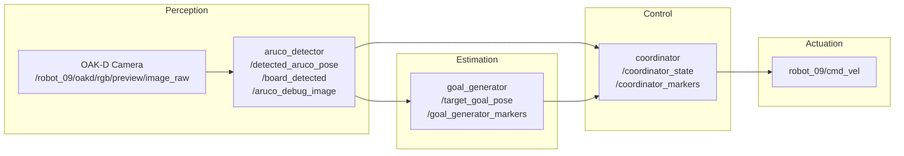

## Milestone 2: Mid-Point Technical Proof

---

## 1. Kinematics

The TurtleBot 4 uses a differential drive motion model. The robot state is defined as
$$\mathbf{x} = [x, y, \theta]^T$$
where $x$, $y$ is the position and $\theta$ is the heading angle.

Given control inputs linear velocity $v$ and angular velocity $\omega$, the state update over timestep $\Delta t$ is:

$$\begin{bmatrix} x_{t+1} \\ y_{t+1} \\ \theta_{t+1} \end{bmatrix} = \begin{bmatrix} x_t + v \cos(\theta_t)\,\Delta t \\ y_t + v \sin(\theta_t)\,\Delta t \\ \theta_t + \omega\,\Delta t \end{bmatrix}$$

In our coordinator node, the control inputs are computed directly from the board pose in camera frame using a proportional controller:

$$v = K_{\text{lin}} \cdot (z_{\text{board}} - d_{\text{target}})$$

$$\omega = -K_{\text{ang}} \cdot x_{\text{board}}$$

where $z_{\text{board}}$ is the board depth (distance from camera), $x_{\text{board}}$ is the lateral offset, $d_{\text{target}} = 0.5\,\text{m}$ is the desired follow distance, and $K_{\text{lin}} = 0.5$, $K_{\text{ang}} = 1.0$ are the proportional gains.

---

## 2. System Architecture

### 2.1 Computational Map

### 2.2 Topics

| Topic | Message Type | Publisher | Subscriber |
|---|---|---|---|
| `/robot_09/oakd/rgb/preview/image_raw` | `sensor_msgs/Image` | TurtleBot OAK-D | `aruco_detector` |
| `/detected_aruco_pose` | `geometry_msgs/PoseStamped` | `aruco_detector` | `goal_generator` |
| `/board_detected` | `std_msgs/Bool` | `aruco_detector` | `goal_generator`, `coordinator` |
| `/aruco_debug_image` | `sensor_msgs/Image` | `aruco_detector` | RViz2 |
| `/aruco_markers` | `visualization_msgs/MarkerArray` | `aruco_detector` | RViz2 |
| `/target_goal_pose` | `geometry_msgs/PoseStamped` | `goal_generator` | `coordinator` |
| `/goal_generator_markers` | `visualization_msgs/MarkerArray` | `goal_generator` | RViz2 |
| `/coordinator_state` | `std_msgs/String` | `coordinator` | RViz2 |
| `/coordinator_markers` | `visualization_msgs/MarkerArray` | `coordinator` | RViz2 |
| `/robot_09/cmd_vel` | `geometry_msgs/TwistStamped` | `coordinator` | TurtleBot motors |
| `/tf` | `tf2_msgs/TFMessage` | `aruco_detector` | RViz2 |

---

## 3. Module Descriptions

### 3.1 Module Declaration Table

| Module | Type | Status | Source File |
|---|---|---|---|
| `aruco_detector` | Custom | Completed | [aruco_detector.py](https://github.com/Mobile-Robots-UGV/arucho-detection-goal-generator-coordinator/blob/main/final_project/aruco_detector.py) |
| `goal_generator` | Custom | Completed | [goal_generator.py](https://github.com/Mobile-Robots-UGV/arucho-detection-goal-generator-coordinator/blob/main/final_project/goal_generator.py) |
| `coordinator` | Custom | Completed | [coordinator.py](https://github.com/Mobile-Robots-UGV/arucho-detection-goal-generator-coordinator/blob/main/final_project/coordinator.py) |
| OAK-D Camera Driver | Library | Completed | TurtleBot firmware |
| Static TF Publisher | Library | Completed | launch file |
| RViz2 | Library | Completed | launch file |

### 3.2 aruco_detector.py

Subscribes to the TurtleBot OAK-D camera topic over WiFi (`USE_TURTLEBOT_CAMERA = True`) or reads directly from the PC webcam (`USE_TURTLEBOT_CAMERA = False`). Each frame is processed by OpenCV's ArUco detector using `DICT_6X6_250`. When all 4 markers (IDs 1, 2, 3, 4) are detected, `solvePnP` computes the full 6-DOF pose in camera frame. An EMA filter with `alpha=0.25` smooths noisy pose estimates. The node publishes:
- `/detected_aruco_pose` — board center pose in `camera_frame`
- `/board_detected` — boolean visibility flag
- `/aruco_debug_image` — annotated camera feed for RViz2
- `/aruco_markers` — 3D sphere, arrow, and line markers for RViz2
- TF transform `camera_frame → board_frame`

All values are expressed in **camera frame** convention: `+X = right`, `+Y = down`, `+Z = forward (depth)`.

### 3.3 goal_generator.py

Subscribes to `/detected_aruco_pose` and maintains a rolling history of the last 10 pose measurements. Velocity `(vx, vy, vz)` is estimated using linear regression (`numpy.polyfit`) on the pose history. The predicted future position is:

$$\text{pred} = \text{pos}_{\text{current}} + \mathbf{v} \cdot t_{\text{predict}}$$

where $t_{\text{predict}} = 0.5\,\text{s}$. The robot goal Z is offset by `follow_distance = 0.5m` short of the predicted board position. Publishes `/target_goal_pose` and `/goal_generator_markers` including velocity arrows, goal sphere, and text labels in RViz2.

### 3.4 coordinator.py

Implements a three-state machine: **FOLLOW → LOST → SEARCH**. In FOLLOW state, a proportional controller maps board pose directly to `TwistStamped` velocity commands on `robot_09/cmd_vel`. In LOST state, the robot stops and waits up to 5 seconds for re-detection. In SEARCH state, the robot rotates in place at `0.3 rad/s` for up to 30 seconds scanning for the board. State transitions are driven by `/board_detected` miss count vs. `miss_threshold = 5`.

---

## 4. Experimental Analysis & Validation

### 4.1 Sensor Calibration

Camera intrinsic calibration was performed using a chessboard pattern (`camera_calib_oak.npz`). The calibration provides the camera matrix and distortion coefficients used by `solvePnP` for accurate 3D pose estimation.

Board extrinsic calibration is defined in `board_config.json`, which specifies the physical `top_left_xy_m` position of each marker relative to the board center. The marker size is `0.0225m` and the board uses `DICT_6X6_250`.

### 4.2 Coordinate Frame Convention

All pose values are expressed in **camera frame**:

| Axis | Direction | Used for |
|---|---|---|
| `+X` | Right of camera center | Steering (`angular_z`) |
| `+Y` | Below camera center | Not used for control |
| `+Z` | Forward (depth) | Driving (`linear_x`) |

Since the static TF publishes `map → camera_frame` at the origin with zero rotation, `camera_frame` and `map` are coincident at startup, making camera frame effectively the global reference frame for this project.

### 4.3 Run-Time Issues & Recovery

| Issue | Observed Behavior | Recovery Logic |
|---|---|---|
| Board temporarily occluded | `miss_count` increments each frame | FOLLOW → LOST after 5 misses |
| Board lost for >5 seconds | Robot stops in LOST state | LOST → SEARCH after timeout |
| Board not found during search | Robot rotates continuously | SEARCH resets timer after 30s |
| VMware USB passthrough instability | OAK-D disconnects on boot | Subscribe to ROS2 topic over WiFi instead |
| QoS mismatch | RViz2 Image display shows "No Image" | Publisher set to `BEST_EFFORT`, RViz2 set to match |

---

## 5. Individual Contribution

| Team Member | Primary Technical Role | Key Contributions |
|---|---|---|
| Lu Yan Tan | Perception & Detection | `aruco_detector.py` — ArUco detection, solvePnP, TF broadcast, RViz2 markers |
| Prajjwal | Prediction & Goal Generation | `goal_generator.py` — velocity estimation, future position prediction, RViz2 visualization |
| Tatwik Meesala | State Machine & Control | `coordinator.py` — FOLLOW/LOST/SEARCH state machine, proportional velocity controller |