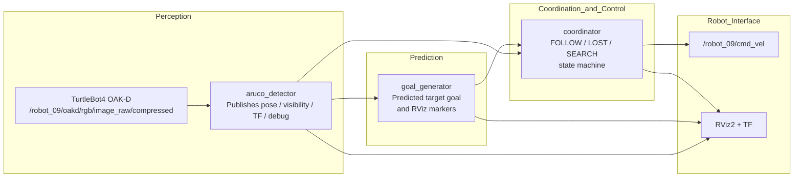
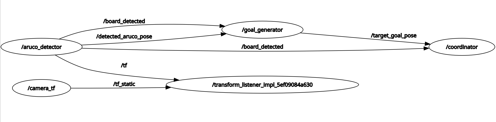

## Milestone 2: SmartFollower & Tracker Mid-Point Technical Proof

This milestone documents our mid-point system for the **SmartFollower & Tracker (SFT)** project.  
While the baseline repository demonstrates ArUco-board pose estimation from the TurtleBot 4 OAK-D camera, our current system goes beyond pose estimation and integrates:

- real-time ArUco board detection and 6-DoF pose estimation
- predicted target-goal generation for smoother following
- closed-loop robot following control with FOLLOW / LOST / SEARCH recovery
- RViz2 visualization and TF integration
- hardware deployment on TurtleBot 4 with OAK-D over ROS 2 Jazzy

This milestone is therefore not only a reproduction of the board-pose pipeline, but an extension toward a full target-tracking and smart-following stack.

---

## 0. Relation to Prior Work and Project Scope

Our implementation builds on the TurtleBot 4 OAK-D ArUco-board pose-estimation workflow.  
The reference pipeline detects a known 4-marker ArUco board, estimates its 6-DoF pose, and publishes board pose, orientation, visibility, detected marker IDs, and TF.

Our project extends that baseline in three important ways:

1. **Tracking-oriented outputs instead of pose-only outputs**  
   We use the detected board pose as the perception input to a downstream tracking and following stack.

2. **Prediction and goal generation**  
   Instead of commanding the robot directly from instantaneous detections only, we estimate short-horizon target motion and generate a follow goal.

3. **Autonomous follow behavior with recovery logic**  
   We add a coordinator state machine with FOLLOW, LOST, and SEARCH modes to make the robot robust to temporary target loss.

This aligns the system with our broader SmartFollower & Tracker project objective: autonomous target following in a dynamic indoor environment.

## 1. Kinematics

The TurtleBot 4 uses a differential drive motion model. The robot state is defined as:

$$\mathbf{x} = [x, y, \theta]^T$$

where $$x$$, $$y$$ is the position and $$\theta$$ is the heading angle.

Given control inputs linear velocity $$v$$ and angular velocity $$\omega$$, the state update over timestep $$\Delta t$$ is:

$$\begin{bmatrix} x_{t+1} \\ y_{t+1} \\ \theta_{t+1} \end{bmatrix} = \begin{bmatrix} x_t + v \cos(\theta_t) \Delta t \\ y_t + v \sin(\theta_t) \Delta t \\ \theta_t + \omega \Delta t \end{bmatrix}$$

In our current mid-point system, the coordinator ultimately generates control inputs from the detected and predicted board motion expressed in camera frame. At this stage, the control law is still a proportional tracking controller, but it is embedded inside a larger perception → goal generation → coordination pipeline:

These equations describe the low-level follow behavior used by the coordinator; however, the complete system also includes target detection, short-horizon prediction, and recovery behavior when the board is temporarily lost.

$$v = K_{lin} \cdot (z_{board} - d_{target})$$

$$\omega = -K_{ang} \cdot x_{board}$$

where $$z_{board}$$ is the board depth (distance from camera), $$x_{board}$$ is the lateral offset, $$d_{target} = 0.5$$ m is the desired follow distance, and $$K_{lin} = 0.5$$, $$K_{ang} = 1.0$$ are the proportional gains.

---

## 2. System Architecture

### 2.1 Computational Map

RQT graph:

### 2.2 Topics

| Topic | Message Type | Publisher | Subscriber / Consumer |
|---|---|---|---|
| `/robot_09/oakd/rgb/image_raw/compressed` | `sensor_msgs/msg/CompressedImage` | TurtleBot 4 OAK-D | `aruco_detector` |
| `/detected_aruco_pose` | `geometry_msgs/msg/PoseStamped` | `aruco_detector` | `goal_generator`, `coordinator` |
| `/board_detected` | `std_msgs/msg/Bool` | `aruco_detector` | `goal_generator`, `coordinator` |
| `/aruco_debug_image` | `sensor_msgs/msg/Image` | `aruco_detector` | RViz2 |
| `/aruco_markers` | `visualization_msgs/msg/MarkerArray` | `aruco_detector` | RViz2 |
| `/target_goal_pose` | `geometry_msgs/msg/PoseStamped` | `goal_generator` | `coordinator` |
| `/goal_generator_markers` | `visualization_msgs/msg/MarkerArray` | `goal_generator` | RViz2 |
| `/coordinator_state` | `std_msgs/msg/String` | `coordinator` | RViz2 / logs |
| `/coordinator_markers` | `visualization_msgs/msg/MarkerArray` | `coordinator` | RViz2 |
| `/robot_09/cmd_vel` | `geometry_msgs/msg/TwistStamped` | `coordinator` | TurtleBot 4 base controller |
| `/tf` | `tf2_msgs/msg/TFMessage` | `aruco_detector` | RViz2 / TF tools |

---

## 3. Module Descriptions

### 3.1 Module Declaration Table

| Module | Type | Status | Role in System | Source File |
|---|---|---|---|---|
| `aruco_detector` | Custom | Completed | Detects 4-marker board, solves 6-DoF pose, publishes TF and debug outputs | `aruco_detector.py` |
| `goal_generator` | Custom | Completed | Predicts short-horizon target motion and publishes follow goal | `goal_generator.py` |
| `coordinator` | Custom | Completed | Executes FOLLOW / LOST / SEARCH state machine and robot command output | `coordinator.py` |
| OAK-D camera topic interface | System | Completed | Provides compressed RGB stream from TurtleBot 4 | TurtleBot 4 stack |
| Static TF / frame setup | System | Completed | Provides frame consistency for visualization and integration | launch/config |
| RViz2 visualization | System | Completed | Displays detections, goals, and controller state | RViz2 config |

### 3.2 aruco_detector.py

This module is the perception front end of the system. It subscribes to the TurtleBot 4 OAK-D compressed RGB topic and decodes each frame for OpenCV ArUco processing. Using the configured 4-marker board geometry and camera calibration, it estimates the board pose with `solvePnP`.

Implemented functionality includes:

- compressed image subscription and decoding
- 4-marker board detection using `DICT_6X6_250`
- 6-DoF board pose estimation in camera frame
- exponential moving average smoothing (`alpha = 0.25`)
- board visibility reporting
- TF broadcast from `camera_frame` to `board_frame`
- RViz2 debug image and marker visualization

Published outputs:

- `/detected_aruco_pose` — smoothed board-center pose in `camera_frame`
- `/board_detected` — board visibility flag
- `/aruco_debug_image` — annotated image for visualization
- `/aruco_markers` — marker visualization in RViz2
- `/tf` — transform from camera frame to board frame

All values are expressed using camera-frame convention: `+X = right`, `+Y = down`, `+Z = forward`.

### 3.3 goal_generator.py

This module extends the baseline board-pose pipeline into a tracking-oriented system. Rather than using only the instantaneous board pose, the node maintains a short history of recent detections and estimates target velocity using linear regression over time.

The predicted future target position is computed as:

$$\text{pred} = \text{pos}_{\text{current}} + \mathbf{v} \cdot t_{\text{predict}}$$

where $t_{\text{predict}} = 0.5\,\text{s}$.

A follow goal is then generated by offsetting the predicted target position by a configurable stand-off distance (`follow_distance = 0.5\,\text{m}`), which improves smoothness compared to direct frame-by-frame chasing.

Published outputs include:

- `/target_goal_pose`
- `/goal_generator_markers`

The RViz markers visualize the predicted motion, follow goal, and tracking geometry, making this module a key bridge between perception and closed-loop robot following.

### 3.4 coordinator.py

This module is the behavior and control layer of the mid-point system. It consumes board visibility and target-goal information and commands the TurtleBot 4 through a three-state recovery-aware controller:

- **FOLLOW**: track the target using proportional distance and heading control
- **LOST**: stop the robot and wait briefly for re-detection
- **SEARCH**: rotate in place to reacquire the target

State transitions are driven by board visibility and timeout logic.  
At mid-point, this gives the system a practical target-following capability with basic robustness to occlusion and intermittent perception failure.

The coordinator publishes:

- `TwistStamped` commands to `/robot_09/cmd_vel`
- textual state information on `/coordinator_state`
- visualization markers on `/coordinator_markers`

This module is the main step that moves the project from “board pose estimation” to “autonomous smart following.”

---

## 4. Experimental Analysis & Validation

At this milestone, our validation focus is to show that the core SmartFollower & Tracker pipeline is working end-to-end on hardware: perception, target-goal generation, robot following, target-loss recovery, and visualization. Full project goals such as obstacle avoidance in dynamic warehouse settings and 2D reconstruction are part of the broader final-system scope and are not yet fully claimed in this milestone.

### 4.1 Sensor Calibration

Camera intrinsic calibration was performed using a chessboard pattern (`camera_calib_oak.npz`). The calibration provides the camera matrix and distortion coefficients used by `solvePnP` for accurate 3D pose estimation.

Board extrinsic calibration is defined in `board_config.json`, which specifies the physical `top_left_xy_m` position of each marker relative to the board center. The marker size is `0.0225m` and the board uses `DICT_6X6_250`.

### 4.2 Coordinate Frame Convention

All pose values are expressed in **camera frame**:

| Axis | Direction | Used for |
|---|---|---|
| `+X` | Right of camera center | Steering (`angular_z`) |
| `+Y` | Below camera center | Not used for control |
| `+Z` | Forward (depth) | Driving (`linear_x`) |

For this milestone implementation, the camera frame is used as the primary operational reference for perception and short-horizon following. A static TF alignment is used for visualization and integration convenience, but this should not be interpreted as a full global localization solution.

### 4.3 Run-Time Issues & Recovery

| Issue | Observed Behavior | Recovery Logic |
|---|---|---|
| Board temporarily occluded | `miss_count` increments each frame | FOLLOW → LOST after 5 misses |
| Board lost for >5 seconds | Robot stops in LOST state | LOST → SEARCH after timeout |
| Board not found during search | Robot rotates continuously | SEARCH resets timer after 30s |
| VMware USB passthrough instability | OAK-D disconnects on boot | Subscribe to ROS2 topic over WiFi instead |
| QoS mismatch | RViz2 Image display shows "No Image" | Publisher set to `BEST_EFFORT`, RViz2 set to match |

### 4.4 What We Added Beyond the Reference Repository

The reference TurtleBot 4 OAK-D ArUco-board repository provides the perception baseline: compressed image subscription, board detection, pose estimation, orientation output, visibility output, detected marker IDs, and TF.

Our milestone system extends beyond that baseline by adding:

- smoothed board-pose tracking for downstream control
- predicted target-goal generation from recent motion history
- a robot-following coordinator state machine
- LOST / SEARCH recovery behavior
- integrated RViz visualization for detection, goals, and controller state
- hardware-tested end-to-end following behavior on TurtleBot 4

Therefore, this milestone should be presented as an **extension of prior board-pose work into a smart-following system**, not just as a reimplementation of the pose-estimation package.

---

## 5. Individual Contribution

| Team Member | Primary Technical Role | Key Contributions |
|---|---|---|
| Tatwik Meesala | Perception and integration | `aruco_detector.py`, board detection pipeline, SolvePnP integration, image transport handling, hardware testing |
| Prajjwal | Prediction and mapping-oriented system development | `goal_generator.py`, future-position estimation, follow-goal generation, broader SLAM / reconstruction direction |
| Lu Yan Tan | Coordination, control, and visualization | `coordinator.py`, FOLLOW / LOST / SEARCH state machine, TF / RViz integration, robot command behavior |

## 6. Demonstration Videos

Below are three short hardware demonstration videos showing the SmartFollower & Tracker system running on the TurtleBot 4 and simulation. The videos highlight the perception, prediction, and hardware implementation of the robot. 

### 5.1 Aruco tracking + Robot state switching
[YouTube Video 1](https://www.youtube.com/watch?v=VIDEO_ID_1)  
*Real‑time board detection, board position and robot state visualization.*

### 5.2 Hardware implemented Target follower
[YouTube Video 2](https://www.youtube.com/watch?v=1Pdddi-QHHU)  
*Turtlebot following Arucho board in view.*

### 5.3 Target tracking + prediction simulation
[YouTube Video 3](https://www.youtube.com/watch?v=J7BFnYV3Crw)  
*Simulation of robot tracking a target with EKF.*

> Replace `VIDEO_ID_1`, `VIDEO_ID_2`, `VIDEO_ID_3` with your actual YouTube IDs.

## 7. Mid-Point Status Summary

By Milestone 2, we have demonstrated a working hardware pipeline that:

- detects a known 4-marker ArUco board using the TurtleBot 4 OAK-D camera
- estimates the board pose in real time
- predicts short-horizon target motion
- generates a follow goal
- commands the robot through a recovery-aware FOLLOW / LOST / SEARCH controller
- visualizes the system in RViz2 with TF support

This confirms that the project has progressed beyond pose-only perception and now includes the core behavior required for a SmartFollower & Tracker system. The remaining project scope focuses on expanding robustness, safety behavior, obstacle interaction, and reconstruction-oriented outputs toward the final system objective.